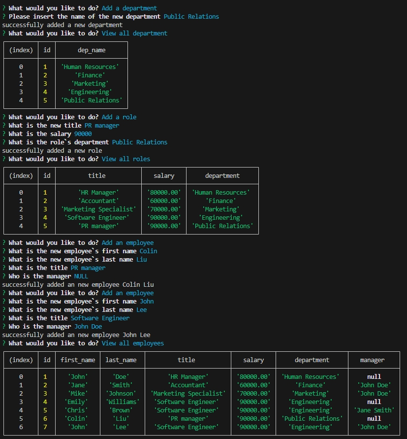

# Employee-Tracker

## Description

an Node.js based SQL enquiry to query the data in the database.

## Table of Contents

- [Installation](#installation)
- [Usage](#usage)
- [License](#license)
- [Contribution](#contribution)
- [Test](#test)
- [Further Questions](#furtherquestions)

## Installation

Open the directory from VS Code.

1. go to the db directory, use $mysql -u root -p  to longin, then construct the db structure and seed records by source schema.sql & seeds.sql

2. go back to the root directory, install using $npm install

3. start the app by $node index.js

## Usage

1. Initialize the database:

  

2. View records in structured tables by choosing the options accordingly:

  

3. Add records following by the questions prompted:

  

4. undate employee data following by the questions prompted:

  

5. other functions available inc 'Delete departments,roles or employees',
    'View the total utilized budget of a department',
    and  'Exit':

  

6. here is the video walk through of the installation & query:
https://drive.google.com/file/d/1TKoWlykdNd9uiIh9TAI6q_F43_nSwOLK/view

## License

N/A

## Contribution
You can contribute to this application by revising the codes here:  
https://github.com/mkdkck/Employee-Tracker

## Test
N/A

## FurtherQuestions

please review the codes here：  
https://github.com/mkdkck/Employee-Tracker

or contact the owner via: colin173@gmail.com

## Badges

